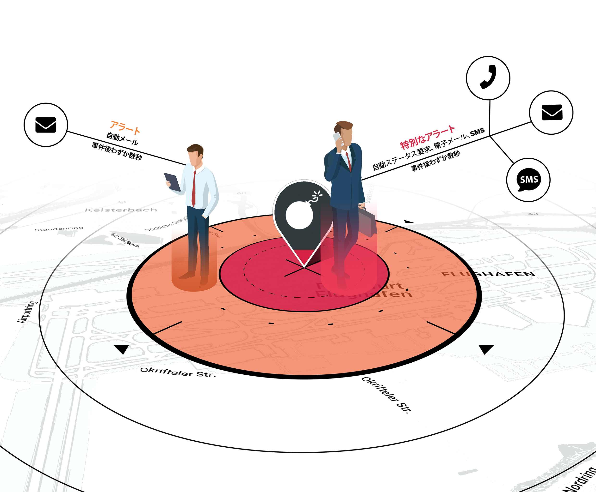

# TRAVEL EYE GOLD

## 紹介動画



### 商品概要

Travel Eye Goldは、24時間年中無休で世界中で発生したセキュリティ事案を特定し、レポーティングを行う**モビリティ・リスクマネジメントプラットフォーム**であり、200カ国以上のカントリーリスクやシティリスクに関する分析情報をユーザーに提供しています。さらに、本プラットフォームには、様々なリスクレイヤーや世界中の医療機関に関する情報も掲載しています。 

### 

## 主な機能

Travel Eye Goldにより以下のことが可能になります:

* 渡航リスクを特定し、最小限にとどめる
* 人工知能を活用し、渡航者に影響を及ぼすセキュリティ事案を迅速に特定する
* 治安情報やカスタマイズされたダイジェスト情報を電子メールで受信し、最新の治安動向を常に把握する
* 従業員の方が慣れ親しんだ言語での表示

## 本マニュアルの目的

本マニュアルは、モビリティ・リスクマネジメントプラットフォームであるTravel Eye Goldの重要な機能および特徴を伝えることを目的としています。主にプラットフォームの管理者向けに書かれていますが、権限を有しないユーザーにとっても役立つ内容となっています。各セクションの最後には、ユーザーからの質問と返答をまとめた「よくある質問」のページを設けています。


注意事項: 本マニュアルはユーザーガイドであり、プラットフォームのアラートプロセスや導入・認証・ログイン手続に関する技術的な詳細情報を提供するものではありません。 


