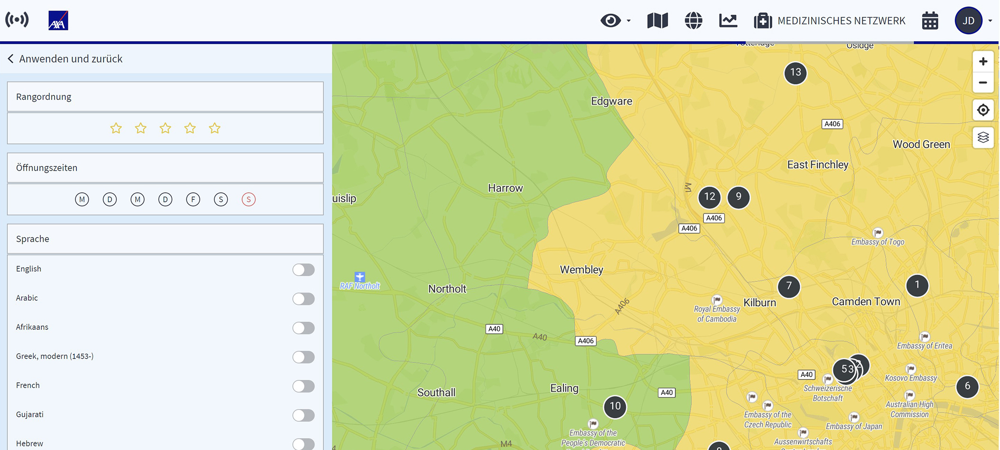

# Nutzerprofil

## Wie kann ich mein persönliches Konto verwalten?

Das Nutzerprofil der Plattform ist ein wichtiges Element. Hier können die Nutzer ihre persönlichen Daten und Einstellungen verwalten. Sie können ihren Namen, ihre E-Mail-Adresse und ihre Telefonnummer festlegen, die als Hauptkontaktdaten für die Plattform in Notfällen und für alle anderen Informationen zur Verfügung stehen.

Darüber hinaus können die Benutzer ihre gewünschte Sprache und Zeitzone auswählen. Wenn sich der Nutzer über Nutzername und Passwort einloggt, kann er hier auch sein Passwort ändern.

Für zusätzliche Sicherheit können sie auch eine Zwei-Faktor-Authentifizierung für ihr Konto aktivieren. Im Nutzerprofil können Nutzer auch ihr persönliches Beschäftigungsland bestimmen.

