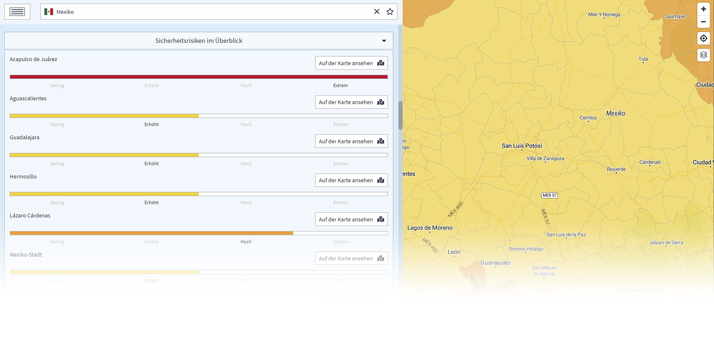

# Gesamtrisiko

Kriminalität, zivile Unruhen, Terrorismus, allgemeine Risiken und politische Stabilität sind Schlüsselkategorien, die bewertet werden müssen, um ein grundlegendes Länderrisikoportfolio zu erstellen. Zusätzlich ermitteln unsere Experten Risiken für die wichtigsten Städte jedes Landes und fügen jeden Monat neue Informationen hinzu, z.B. über konkrete Gebiete, die Reisende meiden sollten.

