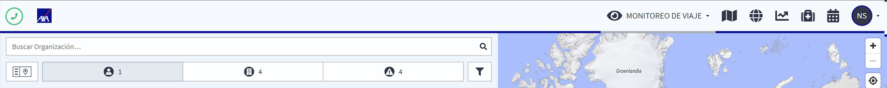

# Para Comenzar

## DESCUBRA LA PLATAFORMA

Hay varias funciones básicas que están siempre visibles en la parte superior de cada página: la **barra de navegación**, el **botón de emergencia** y, en las páginas principales, **divisor de pantalla**.

## BARRA DE NAVEGACIÓN

Para empezar a usar la plataforma pruebe la barra de navegación. Clique/toque el icono correspondiente y vaya directamente en la **Función de Botón de Emergencia,** **el Mapa de Riesgo**, **los Eventos Globales**, **la Información por País** y también **el Red Médica**. Por último, puede acceder a su perfil para administrar su cuenta personal o la de otros, según sus permisos.

## BOTÓN DE EMERGENCIA 

HAGA UNA LLAMADA DE ASISTENCIA

En situaciones críticas, el viajero puede pulsar el botón y se conectará automáticamente con el Centro de Operaciones AXA designado. Esta función es todavía más importante para los viajeros que están en una situación peligrosa; sólo con pulsar el botón, del viajero se transmitirá inmediatamente al Centro de Operaciones y activará los procesos de emergencia consecuentes.

## DIVISOR DE PANTALLA / VISTAS

Dependiendo del tamaño de pantalla que use, hay distintos divisores de pantalla disponibles. Mientras navega por las diferentes páginas y usa la plataforma, puede ajustar la vista de la pantalla a su gusto con uno o dos clics en el icono de modo de vista, que siempre se encuentra en la parte superior izquierda de la pantalla. En todas las vistas para móvil puede cambiar de panel de navegación a vista del mapa con un clic en el icono del mapa o viceversa.

