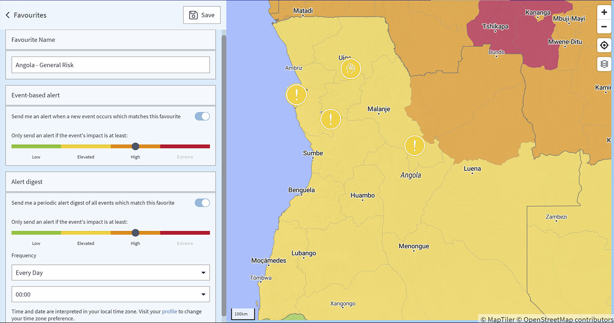

# FAQ

## What is an announcement and a security information?

### **ANNOUNCEMENT**

An announcement is a security-related incident that can be expected in the future, such as strikes and demonstrations.

### SECURITY INFORMATION

A security information is an incident information you receive via email when setting a favourite on the global events page or for a specific country on the country risks page. Once the system detects an incident that matches your favourite, you will receive an email with the incident information.


Please note that security information for an incident with impact low and elevated do not include recommendations.


Additionally, you can schedule a **periodic alert digest** of all events which match this favourite.

### 

