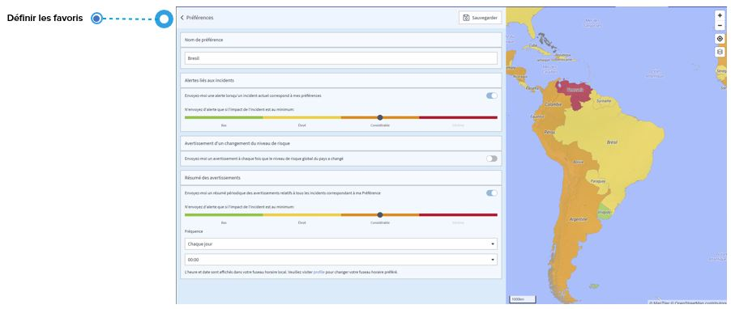

# FAQ

## Qu'est-ce qu'une annonce et une information ?

### **ANNONCE**

Une annonce est un incident lié à la sécurité auquel on peut s'attendre à l'avenir, comme des grèves ou des manifestations.

### INFORMATION

Information est le titre d'une information sur un incident que vous recevez par courrier électronique lorsque vous définissez un favori sur la page des événements mondiaux ou pour un pays spécifique sur la page des risques pays. Lorsque le système détecte un incident qui correspond à votre favori, vous recevez un courrier électronique contenant des informations sur l'incident.


Veuillez noter que les informations pour un incident ayant un impact bas et élevé n'incluent pas de recommandations.


De plus, vous pouvez programmer un **résumé d'alertes périodique** de tous les événements qui correspondent à ce favori.

