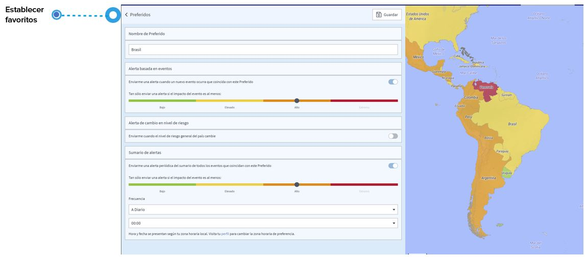

# Preguntas Frecuentes

## ¿Qué es un anuncio e una información de seguridad?

### **ANUNCIO**

Un anuncio es un incidente relacionado con la seguridad que podría producirse en el futuro, como huelgas o manifestaciones.

### INFORMACIÓN DE SEGURIDAD

La información de seguridad/alerta es información de un incidente que recibe por correo electrónico cuando escoge un favorito en la página de eventos globales o por un país específico en la página de riesgos por país. Cuando el sistema detecta un incidente que coincide con su favorito, recibirá un correo electrónico con la información del incidente.


Tenga en cuenta que la información de seguridad para un incidente con impacto bajo y elevado no incluye recomendaciones.


Además, puede programar una **alerta periódica del sumario** de todos los eventos que coincidan con este favorito.

### \*\*\*\*

