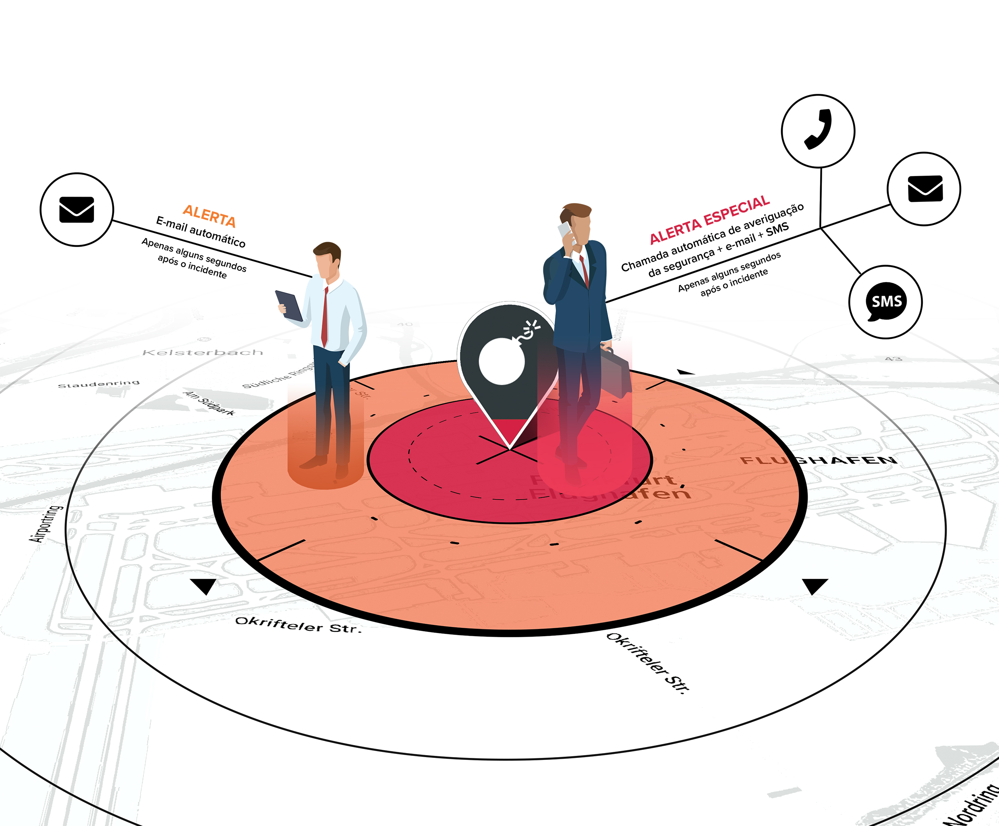

# Panoramica del Prodotto

### VIDEO INTRODUTTIVO



## PANORAMICA DEL PRODOTTO

Travel Eye Gold è una **piattaforma di gestione del rischio di mobilità** che identifica e segnala gli incidenti di sicurezza in tutto il mondo 24 ore su 24, 7 giorni su 7, e fornisce agli utenti oltre 200 profili di rischio di paesi e città. Inoltre, la piattaforma include vari livelli di rischio e fornitori di servizi medici a livello globale.

## CARATTERISTICHE CHIAVE

To summarize, Travel Eye Gold:

* Identifica e minimizza i rischi del viaggio
* Trova rapidamente gli incidenti di sicurezza rilevanti con l'aiuto dell'intelligenza artificiale
*  Invia informazioni sulla sicurezza e digest personalizzati via e-mail per tenervi informati sugli ultimi sviluppi in materia di sicurezza
* Comunica nella lingua con cui i vostri dipendenti si sentono a proprio agio

## OBIETTIVO DI QUESTA GUIDA

La seguente guida intende descrivere le funzioni e le caratteristiche principali di Travel Eye Gold, la piattaforma di gestione dei rischi per la mobilità. È scritta principalmente per gli amministratori della piattaforma, ma può essere utile anche per gli utenti che hanno permessi meno estesi. Dopo ogni sezione, troverete le FAQ che potrebbero rispondere direttamente alle vostre domande.


Nota bene: questa è una guida per l'utente e non fornisce una descrizione tecnica dettagliata del processo di allerta della piattaforma o delle procedure di onboarding/autenticazione/login.


