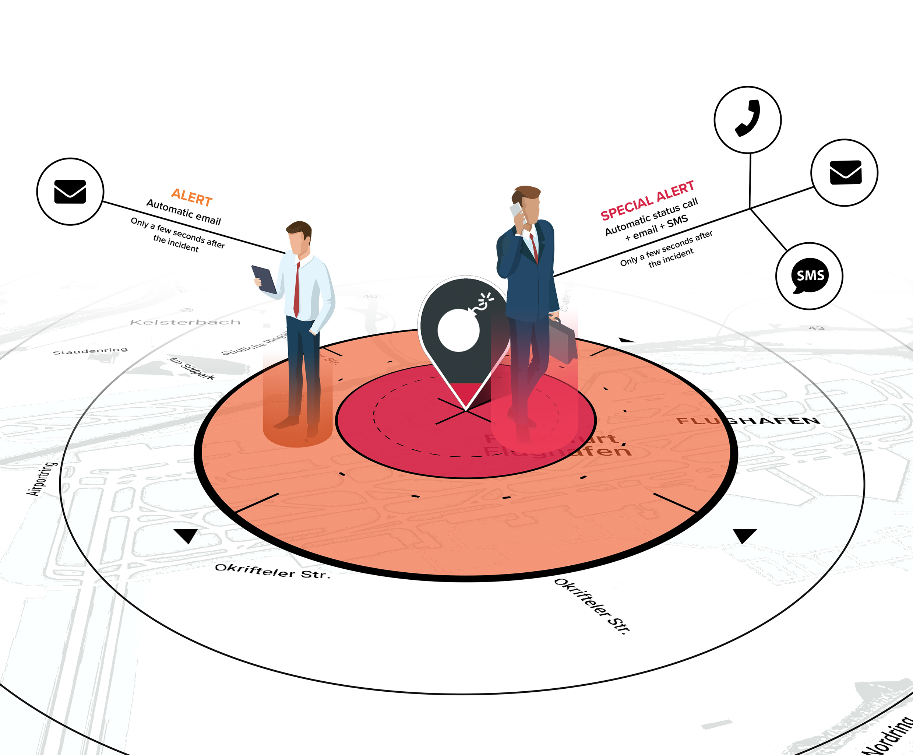

# Product Overview

## INTRODUCTORY VIDEO



## PRODUCT OVERVIEW

Travel Eye Gold is a **mobility risk management platform** that identifies and reports security incidents worldwide 24/7 and provides users with over 200 country and city risk profiles.  Moreover, the platform includes various risk layers and medical providers globally.

## KEY FEATURES

To summarize, Travel Eye Gold:

* Identifies and minimises travel risks
* Finds relevant security incidents rapidly with the help of artificial intelligence
* Sends security information and tailored digests as e-mail to keep you informed about latest security developments 
* Will be displayed in the language your employees feel comfortable with

## INTENTION OF THIS GUIDE

The following guide intends to describe key functions and features of Travel Eye Gold, the mobility risk management platform. It is mainly written for administrators of the platform but can also be useful for users that have less extensive permissions. After each section, you will find FAQs which might directly answer your questions.


Please note: this is a user guide and does not provide a detailed technical description of the platform’s alerting process or the onboarding/authentication/login procedures. 


