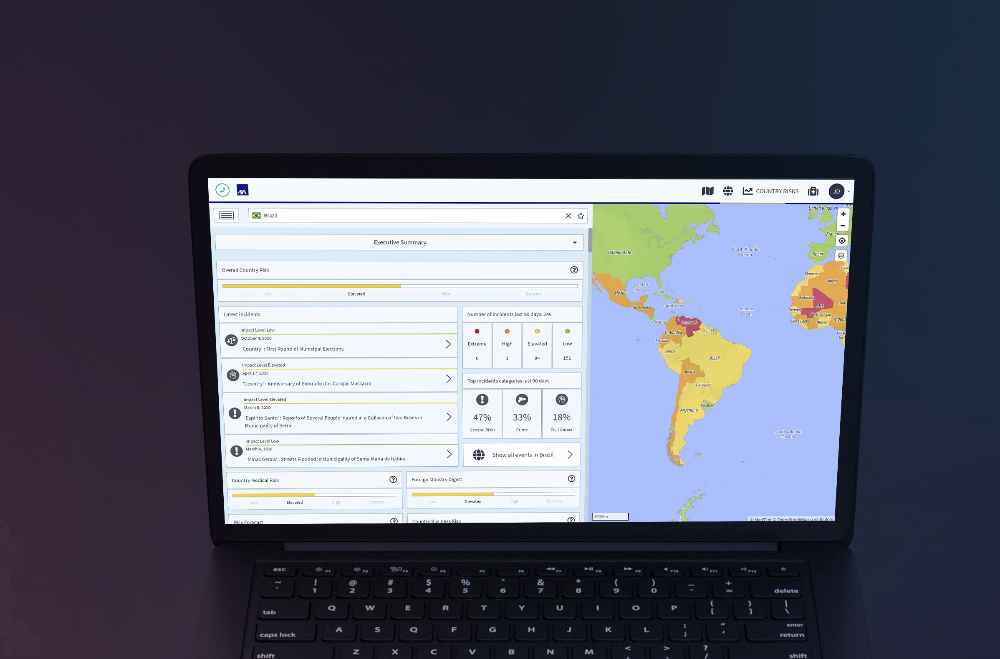

# Produktübersicht

## EINFÜHRUNGSVIDEO



## PRODUKTÜBERSICHT

Travel Eye ist eine **Mobility Risk Management Plattform**, die weltweit 24/7 Sicherheitsvorfälle berichtet und den Nutzern über 200 Länder- und Stadtrisikoprofile zur Verfügung stellt. Darüber hinaus umfasst die Plattform zahlreiche Risikolayer sowie medizinische Anbieter weltweit.

## SCHLÜSSELFUNKTIONEN 

Travel Eye Gold:

* Erkennt und minimiert Reiserisiken
* Erkennt Sicherheitsvorfälle sofort mit der Hilfe von künstlicher Intelligenz
* Sendet Sicherheitsinformationen und regelmäßige Zusammenfassungen via E-Mail, um Sie über die neuesten Sicherheitsentwicklungen zu informieren
* Kommuniziert in der Sprache, in der sich Ihre Mitarbeiter wohlfühlen

## **ZIELSETZUNG DIESES LEITFADENS**

Der folgende Leitfaden beschreibt die wichtigsten Funktionen und Merkmale von Travel Eye, der Mobility Risk Management Plattform. Hauptsächlich ist der Leitfaden für Administratoren und Manager der Plattform geschrieben, er kann jedoch auch für Nutzer mit weniger umfangreichen Berechtigungen hilfreich sein. Nach jedem Abschnitt finden Sie FAQs, welche Ihnen helfen sollen, Ihre Fragen direkt zu beantworten.


**Bitte beachten Sie:** Dies ist ein Benutzerleitfaden und enthält daher keine detaillierte technische Beschreibung des Notfallprozesses der Plattform oder der Anbindungs-/ Authentifizierungs-/Anmeldeverfahren.


