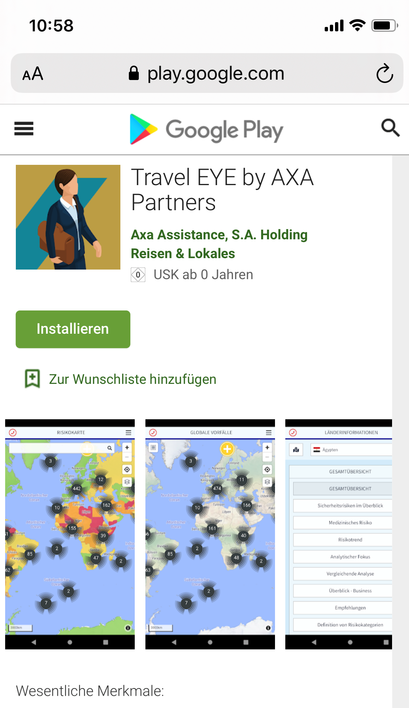
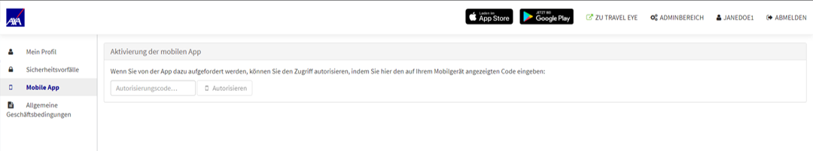

# Travel Eye App

Travel Eye Gold ist auch als browserbasierte Webanwendung und als native mobile Anwendung verfügbar, die Ihnen alle wichtigen Funktionen der Desktop-Version zur Verfügung stellt:

* **Um Unterstützung rufen** - ****In einem Notfall können Sie Ihre jeweilige Operationszentrale direkt anrufen
* **Alerting** - Sie erhalten E-Mails, die Sie über die neuesten Sicherheitsentwicklungen und Vorfälle vor Ort informieren
* **Reisesicherheitsinformation** – Sie können jederzeit auf alle relevanten Informationen über Ihr Reiseziel zugreifen

## BROWSERBASIERTE WEB APP

Die browserbasierte Webanwendung ist die bevorzugte Option für Unternehmen, in denen die Installation von Fremdanwendungen auf Geschäftstelefonen eingeschränkt ist. Ohne eine App installieren zu müssen, haben die Nutzer über den Browser Zugriff auf alle Funktionen, einschließlich der Geolokalisierung und des Notfallbuttons.

## NATIVE APP

Die Travel Eye App für IOS und Android \([Play Store](https://play.google.com/store/apps/details?id=com.exop_group.xassist&gl=IT) oder [App Store](https://apps.apple.com/gb/app/x-assist/id1489592901?l=it)\) bietet sämtliche Funktionalitäten, die Sie auch von der Travel Eye Desktop-Anwendung kennen.

## AKTIVIERUNG DER APP

Um die App, nachdem Sie sie installiert haben, erstmalig zu aktivieren, gehen Sie folgendermaßen vor:

1. Melden Sie sich wie gewohnt auf der Plattform an \(Login\) und öffnen Sie ihr Nutzerprofil. Klicken Sie auf „Mobile App“ auf der linken Bildschirmseite. 
2. Starten Sie nun die App. Beim Starten der App erscheint ein 8-stelliger Autorisierungscode. 
3. Geben Sie den Code auf Ihrem Nutzerprofil in das Feld „Autorisierungscode“ ein und klicken Sie „Autorisieren“. 
4. Sie sind nun permanent für die Nutzung der App auf Ihrem mobilen Gerät angemeldet.

